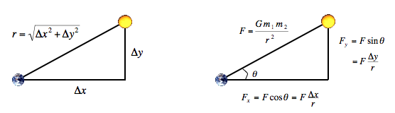

# COMP 380 Lab III: Parallel N-Body Simulation in OpenSHMEM

In this project, you will write an OpenSHMEM program to perform a parallel
$n$-body simulation using the `lotus.rhodes.edu` computing environment. You
will find skeleton code in the `lab3` folder of your GitHub repository.

> **Bonus:** The fastest *correct* submissions will receive a bonus:
>
> 1. 5 point bonus to final exam score and a candybar.
> 2. 5 point bonus to your score on the next exam and a candybar.
> 3. A candybar.

## N-Body Simulation

In this lab, you will use Newton's laws to model a galaxy consisting of $N$
planets (or bodies) moving throughout a three-dimensional space. Each body
influences every other body by gravitational attraction. For simplicity, we'll
look at the theory with two bodies in 2D, but our simulation will be in 3D with
$N$ bodies. A body in our simulation will have a position in $x$, $y$, and $z$
coordinates, a current velocity vector (with $x$, $y$, and $z$ components), and
a mass. We are interested in modeling the movement of bodies in this system due
to gravitational forces. To do this, we will need to determine the position,
velocity, and acceleration of each body. Bodies are seeded with an initial
position and velocity.

Consider the following:

<p align="center">
  
</p>

The distance, $r$, between two planets can be used with Newton's gravity
equation, $F = \frac{Gm_1m_2}{r^2}$, to compute the overall gravitational force
between any two bodies. $G$ is the gravitational constant
$6.67 \times 10^{-11} Nm^2/kg^2$. Once we have solved for the force between two
bodies, we can determine the vector components of this force in each dimension,
as shown in the diagram above.

Next, we can use another of Newton's laws, $F=ma$, and solve for acceleration
in each dimension. The acceleration of the body in the $x$ dimension, $a_x$,
would be $a_x = F_x / m$. Since the acceleration is the change in velocity over
time, we can use acceleration to compute a new velocity. Once we have computed
a new velocity, we can compute a new position for the body after some time
interval, $t$.

The other property from physics that we need is that of *superposition*, which
states that the net force acting on a particle is the sum of the pairwise
forces acting on the particle in a given dimension. This allows us to compute
the interaction between a body and the other $n-1$ bodies in the system and
treat all gravity contributions as their vector sum.

### Timestep Simulation

Rather than deal with the continuous integrals inherent to the model, we can
approximate the continuous motion of planets with a discrete model, the
*leapfrog finite difference approximation*. In this system, we start at some
initial condition, $t_0$. Then we use a fixed time step, $\Delta t$, and
compute the change of acceleration, velocity, and position between each
timestep.

The basic approach is to loop over each body, $b$, in the system. We compute
the interaction between $b$ at time $t$ ($b_t$) and each of the remaining $n-1$
bodies in the system as follows:

1. Compute the net force components, $F_x, F_y, F_z$, between $b_t$ and the
   other body, using the gravitational equation and vector math.
2. Compute the acceleration ($a_x, a_y, a_z$) from step 1, using $F=ma$.
3. Compute the new velocity of $b_{t+1}$: e.g. $v_{x,t+1} = v_{x,t} + a_x \Delta t$
4. Compute the new position of $b_{t+1}$: e.g. $p_{x,t+1} = p_{x,t} + v_x \Delta t$

By performing these steps for a sequence of timesteps, we can simulate the
motion of the bodies in the system. Simulation accuracy is improved when
$\Delta t$ is small, but requires more computation than the same process with
fewer timesteps.

You can find a sequential version of this program in your GitHub repository
(`nbody.c`). You will need to restructure this program to distribute the body
array across the parallel processes and use OpenSHMEM communications as needed
to fetch bodies that reside on other processors. Your program must operate in a
data-parallel fashion and use the SPMD programming model.

## Constraints

You are free to use a variety of different simulation parameters during
development, but your final submission will be run with a problem size of
300,000 bodies and must run on the entire `lotus` cluster. You *must* use a
distributed memory layout regardless of the single-node performance. You
should measure the performance of the main simulation loop; you do not need to
time initialization or startup costs.

You may not replicate the array of bodies (either for $t$ or $t+1$). Each
process is limited to keeping at most an additional $N/P$ amount of body data.
You may elect to use adjunct data structures to improve performance, but **you
may not use any local (non-distributed) data structures of size N**.

Your program should take the number of bodies (`-n`) and number of timesteps
(`-t`) to use as arguments. This implies that you will need to dynamically
allocate your arrays based on this information at runtime. You should need no
fancy memory management beyond `malloc`/`free`. You may store large data
structures as global variables, although they must reside inside a singular
global struct.

Additional constraints may be added later to keep in the spirit of the
competition. The goal is to develop the fastest distributed-memory OpenSHMEM
N-body simulation, not solely to get the fastest result. You may select your
own compiler optimizations or SHMEM parameterizations, within the spirit of the
project. If you are uncertain about the legality of your changes, please ask
for clarification. You must use the provided $O(n^2)$ algorithm.

## Running Your Program

You may run some jobs interactively with the `srun` command as can be seen in
the sample run below. There is a sample batch file in your git repository.
**You should use batch files for any jobs greater than 240 cores.** Your jobs
for this assignment will pre-empt running jobs from the Open Science Grid, so
please be respectful of compute time.

## Sample Output

This is an example run which is running on 1,680 processors with a problem
size $N=300,000$ (`-n`) for five timesteps (`-t`). Please make your output look
like this. You may add debugging statements to help troubleshoot, but they
should not print by default in your submitted code. (Hint: use `#define DEBUG`
and `dbg_printf()` to easily enable/disable printing.) These are *not*
benchmark times to beat. It's just sample output.

```
brian@lotus-login01 $ srun -n 1680 ./lab3_comm -n 300000 -t 5
srun: job 7972 queued and waiting for resources
srun: job 7972 has been allocated resources
beginning N-body simulation of 300000 bodies with 1680 processes over 5 timesteps
timestep 0 complete: 4089.251
timestep 1 complete: 3737.721
timestep 2 complete: 3687.180
timestep 3 complete: 3725.393
timestep 4 complete: 3687.759
execution time: 18945.9913 ms
```
